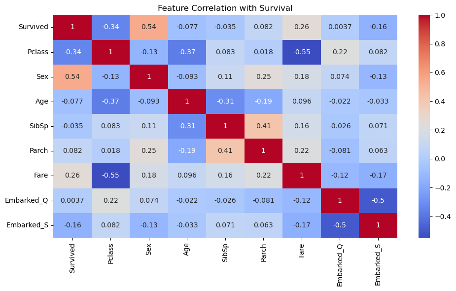
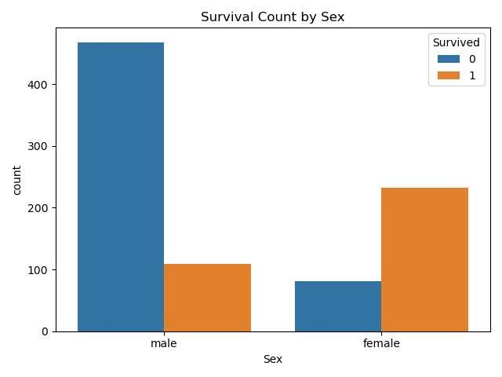
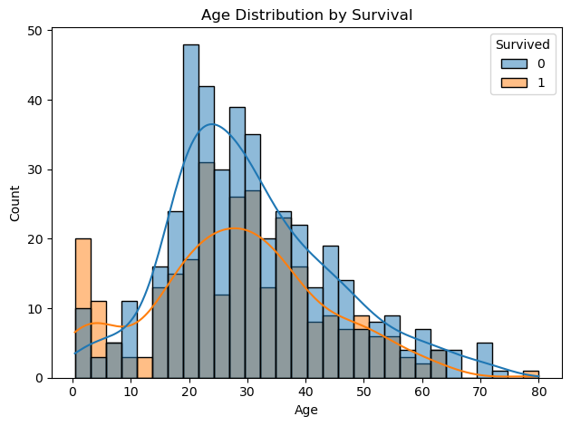

# 🚢 Titanic Survival Predictor

This project predicts passenger survival from the Titanic disaster using Machine Learning models such as **Random Forest Classifier**. The model is trained on the Titanic dataset from Kaggle and includes data preprocessing, exploratory data analysis, model training, evaluation, and Kaggle-ready submission.

---

## 📁 Dataset

- **Source:** [Kaggle – Titanic: Machine Learning from Disaster](https://www.kaggle.com/competitions/titanic/data)
- **Files Used:**
  - `train.csv`: Training data (with labels)
  - `test.csv`: Test data (without labels)
  - `gender_submission.csv`: Sample submission format

---

## 🔧 Features Used

| Feature    | Description                                 |
| ---------- | ------------------------------------------- |
| `Pclass`   | Passenger class (1 = 1st, 2 = 2nd, 3 = 3rd) |
| `Sex`      | Gender of the passenger                     |
| `Age`      | Age in years                                |
| `SibSp`    | # of siblings/spouses aboard                |
| `Parch`    | # of parents/children aboard                |
| `Fare`     | Ticket fare                                 |
| `Embarked` | Port of embarkation (C, Q, S)               |

---

## 🧠 Model Used

- **Random Forest Classifier**

This model was trained using scikit-learn and evaluated using:

- Accuracy Score
- Classification Report (Precision, Recall, F1)

---

## 📊 Exploratory Data Analysis (EDA)

- Handled missing data and categorical variables
- Visualized feature correlations using heatmaps
- Explored survival distributions by gender and age

**Correlation Heatmap:**



**Survival by Sex:**



**Age Distribution by Survival:**



---

## 📈 Model Results

| Metric            | Value                                          |
| ----------------- | ---------------------------------------------- |
| Training Accuracy | ~97%                                           |
| Submission Format | `submission.csv` with PassengerId and Survived |

**Sample Submission Preview:**

```csv
PassengerId,Survived
892,0
893,1
894,0


```
